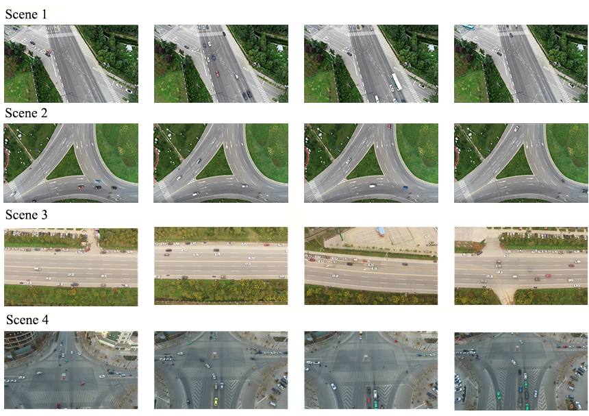

## Abstract

In recent years, UAV technology has developed rapidly. Due to the mobility, low cost and variable monitoring altitude of UAVs,multiple objects detection and tracking in aerial video has become one of the research hotspots in the field of computer vision. However, due to camera motion, small target size, target adhesion and unpredictable target motion, it is still difficult to detect and track targets of interest in aerial video, especially in the case of low frame rate where the target position changes too much. In this paper, we propose a multiple objects tracking algorithm based on dense trajectories voting in aerial video. The method models the multiple target tracking problem as a voting problem of the dense optical flow trajectory to the target ID, which can be applied to aerial surveillance scene and is robust to low frame rate video. More specifically, we first build an aerial video dataset for vehicle targets, including a training dataset and a diverse test dataset. Based on this, we train the neural network model and adopt deep learning method to detect the vehicle in the UAV field of view. Thereafter, we calculate the dense optical flow in adjacent frames, and generate the effective dense optical flow trajectories in each detection bounding box at the current time. When the target IDs of the optical flow trajectories are known, the voting results of the optical flow trajectories in each detection bounding box are counted. Finally, the similarity between detection objects in adjacent frames is measured based on the voting results, and the tracking results are obtained by data association. In order to evaluate the performance of this algorithm,  we conduct experiments on self-built test datasets. A large number of experimental results show that the proposed algorithm can obtain good target tracking results in various complex scenarios, and the performance is still robust at low frame rate by changing the video frame rate. In addition, we carry out qualitative and quantitative comparison experiments between the algorithm and three state-of-art tracking algorithms, which further proves that this algorithm not only can obtain good tracking results in aerial video with normal frame rate, but also has incomparable performance under low frame rate conditions.

## Dataset

Scene 1 is an intersection and Scene 2 is a highway triangular turntable.In these two scenarios, the background is complex and there are many trees. What is more, the target movement is complicated such as straight driving and turning a corner, and the size of targets varies greatly. The video frame rates of Scene 1 and Scene 2 are 30 fps, 10 fps and 5 fps, respectively.Scene 3 is a busy road and Scene 4 is a crossroad.  There are a lot of targets in these two scenarios, which are prone to target adhesion. Moreover, the moving state of the target is complex, such as stationary, straight driving,1080 turning a corner, turning back and so on.The video frame rates of Scene 3 and Scene 4 are 25 fps, 8 fps and 4 fps, respectively.The resolutions of scene 1, scene 2, scene 3, and scene 4 are 3840 x 2160,3840 x 2160,1920 x 1080,1920 x 1080,respectively. 
Dataset can be downloaded on Baidu Cloud Disk [here](https://pan.baidu.com/s/1wZUUkpHGpBks6QYFKUVSFg). Total in size = 4.13G. 

## Demo

Demo video for Multiple Objects Tracking Algorithm Based on Dense Trajectories Voting in Aerial Video can be download on Baidu Cloud Disk [here](https://pan.baidu.com/s/1qa0rWtWLTzC46jfUGT-i5A).

